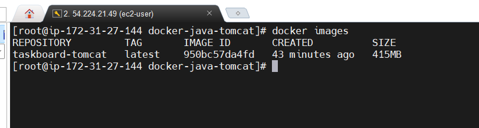
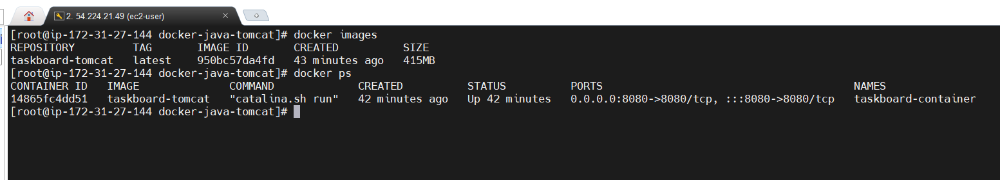
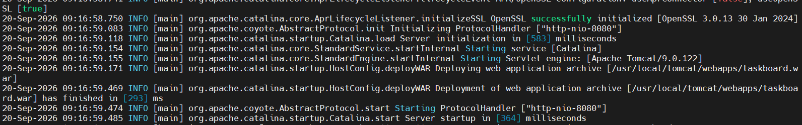
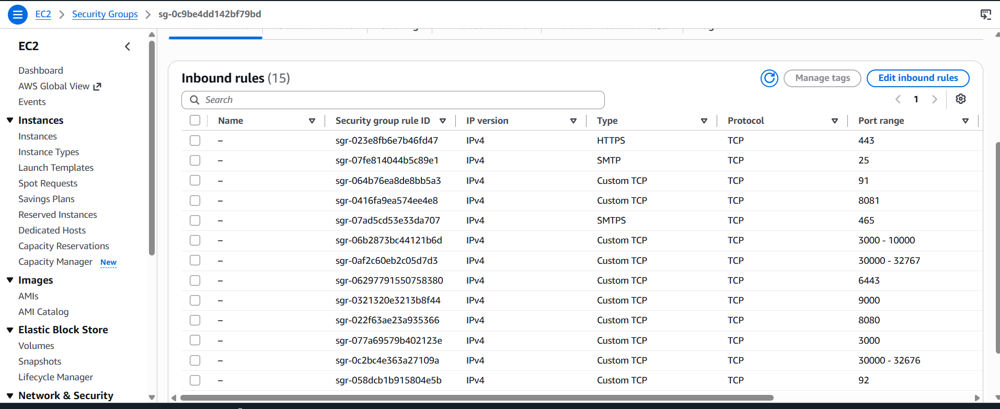
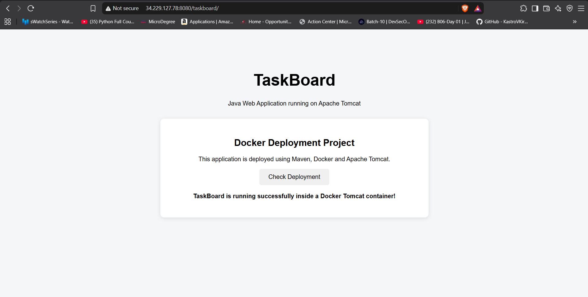

# 🚀 Docker-Based Deployment of a Java Web Application


## 📌 Project Overview

This project demonstrates the **Docker-based deployment of a Java web application** using **Maven, Docker, Apache Tomcat, and AWS EC2**.

The Java web application, **TaskBoard**, is packaged as a WAR file using Maven and deployed inside an Apache Tomcat Docker container.

The project demonstrates a practical deployment workflow where the application source code is obtained from GitHub, built using Maven, packaged as a WAR file, containerized using Docker, and deployed on an AWS EC2 instance.

---

## 🏗️ Architecture

```text
Developer
    |
    | Git Push
    v
GitHub Repository
    |
    | Git Clone
    v
AWS EC2 Linux Server
    |
    +-------------------+
    |                   |
    v                   v
  Maven              Docker
    |                   |
    |                   v
    |            Tomcat Container
    |                   |
    v                   |
taskboard.war <--------+
                        |
                        | Port 8080
                        v
                 AWS Security Group
                        |
                        v
              Web Browser
                        |
                        v
              TaskBoard Application
```

---

## 🛠️ Technologies Used

| Technology                    | Purpose                 |
| ----------------------------- | ----------------------- |
| Java 17                       | Application platform    |
| JSP / HTML / CSS / JavaScript | Web application         |
| Maven                         | Build and WAR packaging |
| Apache Tomcat 9               | Application server      |
| Docker                        | Containerization        |
| AWS EC2                       | Deployment environment  |
| Git                           | Version control         |
| GitHub                        | Source code repository  |
| Linux                         | Server environment      |

---

## 📂 Project Structure

```text
docker-java-tomcat/
│
├── Dockerfile
├── pom.xml
├── README.md
│
├── src/
│   └── main/
│       └── webapp/
│           ├── WEB-INF/
│           │   └── web.xml
│           ├── index.jsp
│           ├── style.css
│           └── app.js
│
└── target/
    └── taskboard.war
```

> `target/` is generated by Maven and is excluded from Git using `.gitignore`.

---

## ⚙️ Application

The application is called **TaskBoard**.

It is a simple Java web application that displays the deployment status and demonstrates that the application is successfully running inside a Dockerized Tomcat environment.

The application includes a **Check Deployment** button that displays:

```text
TaskBoard is running successfully inside a Docker Tomcat container!
```

---

## 🔄 Deployment Workflow

### 1. Clone the Repository

```bash
git clone https://github.com/vishwanathna/docker-java-tomcat.git
cd docker-java-tomcat
```

### 2. Build the Application Using Maven

```bash
mvn clean package
```

Maven creates:

```text
target/taskboard.war
```

### 3. Build the Docker Image

```bash
docker build -t taskboard-tomcat .
```

### 4. Run the Docker Container

```bash
docker run -d \
  --name taskboard-container \
  -p 8080:8080 \
  taskboard-tomcat
```

### 5. Verify the Container

```bash
docker ps
```

Expected port mapping:

```text
0.0.0.0:8080->8080/tcp
```

### 6. Check Tomcat Logs

```bash
docker logs taskboard-container
```

The logs should show Tomcat starting successfully and deploying:

```text
taskboard.war
```

### 7. Access the Application

Open the following URL in a browser:

```text
http://<EC2-PUBLIC-IP>:8080/taskboard/
```

---

## 🐳 Dockerfile

The Dockerfile uses Apache Tomcat as the base image and copies the Maven-generated WAR file into the Tomcat `webapps` directory.

```dockerfile
FROM tomcat:9.0

EXPOSE 8080

COPY target/taskboard.war /usr/local/tomcat/webapps/

CMD ["catalina.sh", "run"]
```

---

## 🔐 AWS Security Group Configuration

The EC2 instance security group allows inbound traffic on:

```text
Protocol: TCP
Port: 8080
```

This allows users to access the Tomcat application from a web browser.

---

## 🧪 Verification

The deployment was verified using:

```bash
docker images
```

```bash
docker ps
```

```bash
docker logs taskboard-container
```

The application was also successfully accessed through:

```text
http://<EC2-PUBLIC-IP>:8080/taskboard/
```

---

## 📸 Screenshots

Screenshots demonstrating the deployment process will be added here.

### Docker Image



### Running Container



### Tomcat Logs



### AWS Security Group



### TaskBoard Application



---

## 🎯 Key Learning Outcomes

* Built a Java web application using Maven.
* Packaged a Java application into a WAR file.
* Created a Docker image using a Dockerfile.
* Deployed a WAR application inside an Apache Tomcat container.
* Used Docker port mapping to expose the application.
* Deployed the containerized application on AWS EC2.
* Configured AWS Security Group rules for application access.
* Used Git and GitHub for source code management.
* Verified application deployment using Docker and Tomcat logs.

---

## 👨‍💻 Author

**Vishwanath Achar**

GitHub: [vishwanathna](https://github.com/vishwanathna)

---

## ⭐ Project Summary

**Docker-Based Deployment of a Java Web Application**

**GitHub → Maven → WAR → Docker Image → Tomcat Container → AWS EC2 → Browser**

